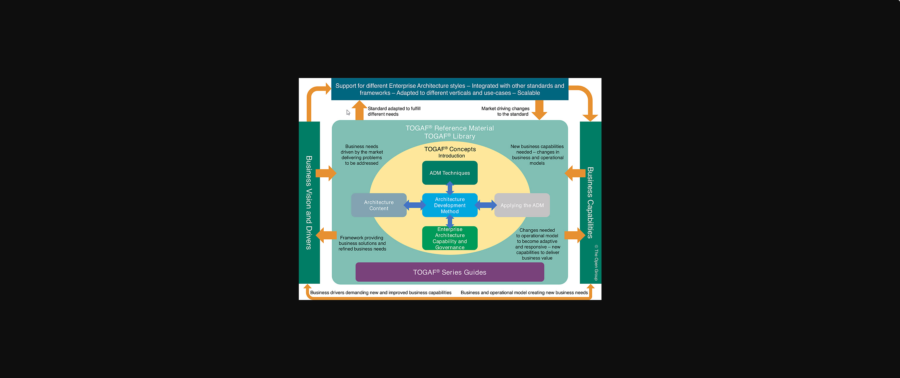
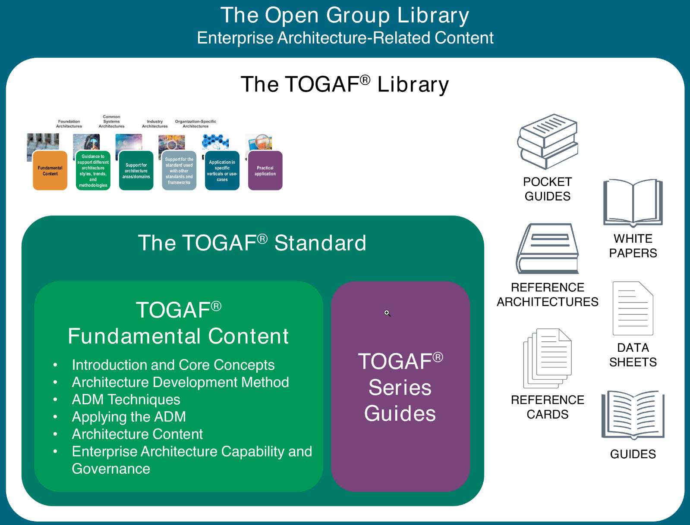
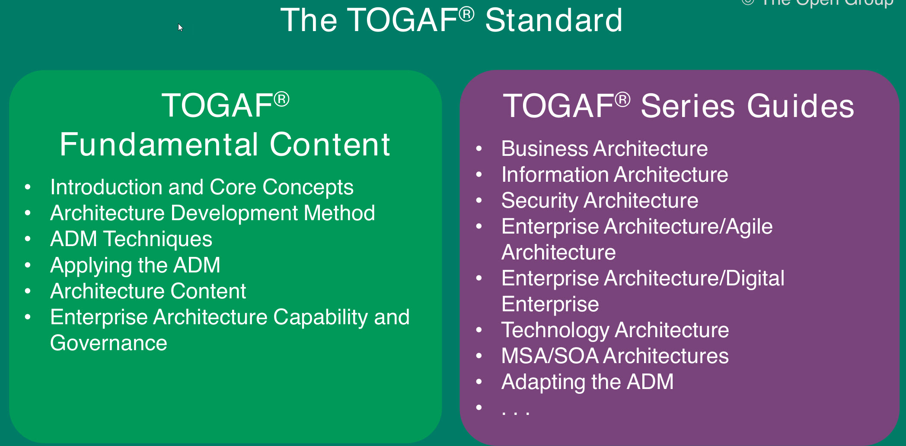
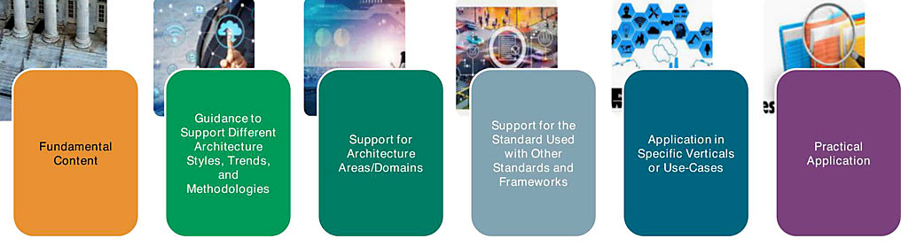

# Structure of TOGAF Documentation Set

## The TOGAF Library
The TOGAF Library is a portfolio of additional guidance material, which supports the practical application of the TOGAF approach

## The TOGAF Standard
The TOGAF Standard describes the generally applicable approach to Enterprise and IT Architecture. It is presented as a series of free-standing, but closely linked documents. It is a foundational framework, which means that it is applicable to the development of any kind of architecture in any context. This foundational framework is supplemented by The Open Group TOGAF Library, an extensive and growing portfolio of guidance material, providing practical guidance in the application of the TOGAF framework in specific contexts

The TOGAF Standard Fundamental Content is presented as six free-standing documents
- [The TOGAF Standard — Introduction and Core Concepts](https://pubs.opengroup.org/togaf-standard/introduction/index.html)
- [The TOGAF Standard — Architecture Development Method](https://pubs.opengroup.org/togaf-standard/adm/index.html)
This document describes the TOGAF Architecture Development Method (ADM) — an iterative approach to developing an Enterprise Architecture.
- [The TOGAF Standard — ADM Techniques](https://pubs.opengroup.org/togaf-standard/adm-techniques/index.html)
This document contains a collection of techniques available for use in applying the TOGAF approach and the TOGAF ADM.

- [The TOGAF Standard — Applying the ADM](https://pubs.opengroup.org/togaf-standard/applying-the-adm/index.html)
This document contains guidelines for adapting the TOGAF ADM to address the specific style of architecture required in a practical context.

- [The TOGAF Standard — Architecture Content](https://pubs.opengroup.org/togaf-standard/architecture-content/index.html)
This document describes the TOGAF Content Framework and a structured metamodel for architectural artifacts, the use of re-usable Architecture Building Blocks (ABBs), and an overview of typical architecture deliverables.

- [The TOGAF Standard — EA Capability and Governance](https://pubs.opengroup.org/togaf-standard/ea-capability-and-governance/index.html)
This document discusses the organization, processes, skills, roles, and responsibilities required to establish and operate an architecture function within an enterprise and describes an Enterprise Architecture governance framework.

- [TOGAF Series Guide](www.opengroup.org/library/guides/togaf/togaf-series-guides)
- [TOGAF Library](http://www.opengroup.org/togaf-library): guidance material to support the practical application of the TOGAF approach. The Reference Library provides guidelines, templates, patterns, and other forms of reference material that can be leveraged in order to accelerate the creation of new architectures for the enterprise

