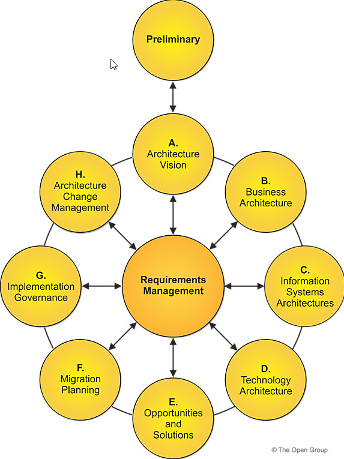

# What is the TOGAF Standard?
The TOGAF Standard is an architecture framework. It provides the methods and tools for assisting in the acceptance, production, use, and maintenance of an Enterprise Architecture. It is based on an iterative process model supported by best practices and a re-usable set of existing architecture assets

# What Kind of Architecture Does the TOGAF Standard Deal With?
There are four architecture domains that are commonly accepted as subsets of an overall Enterprise Architecture
- The **Business Architecture** defines the business strategy, governance, organization, and key business processes
- The **Data Architecture** describes the structure of an organization's logical and physical data assets and data management resources
- The **Application Architecture** provides a blueprint for the individual applications to be deployed, their interactions, and their relationships to the core business processes of the organization
- The **Technology Architecture** describes the digital architecture and the logical software and hardware infrastructure capabilities and standards that are required to support the deployment of business, data, and applications services. This includes digital services, Internet of Things (IoT), social media infrastructure, cloud services, IT infrastructure, middleware, networks, communications, processing, standards, etc

# Architecture Development Model
The ADM includes establishing an architecture framework, developing architecture content, transitioning, and governing the realization of architectures.

All of these activities are carried out within an iterative cycle of continuous architecture definition and realization that allows organizations to transform their enterprises in a controlled manner in response to business goals and opportunities

Phases within ADM
- The **Preliminary Phase** describes the preparation and initiation activities required to create an Architecture Capability including customization of the TOGAF framework and definition of Architecture Principles
- **Phase A: Architecture Vision** describes the initial phase of an architecture development cycle
It includes information about defining the scope of the architecture development initiative, identifying the stakeholders, creating the Architecture Vision, and obtaining approval to proceed with the architecture development.

- **Phase B: Business Architecture** describes the development of a Business Architecture to support the agreed Architecture Vision
- **Phase C: Information Systems Architectures** describes the development of Information Systems Architectures to support the agreed Architecture Vision
- **Phase D: Technology Architecture** describes the development of the Technology Architecture to support the agreed Architecture Vision
- **Phase E: Opportunities & Solutions** conducts initial implementation planning and the identification of delivery vehicles for the architecture defined in the previous phases
- **Phase F: Migration Planning** addresses how to move from the Baseline to the Target Architectures by finalizing a detailed Implementation and Migration Plan
- **Phase G: Implementation Governance** provides an architectural oversight of the implementation
- **Phase H: Architecture Change Management** establishes procedures for managing change to the new architecture
Requirements Management operates the process of managing architecture requirements throughout the ADM

The TOGAF Standard describes how the ADM can be used iteratively to develop a comprehensive Enterprise Architecture landscape. Rather than viewing the ADM graphic as a process model, it is helpful to view it as a reference model defining what has to be done in order to deliver solutions in an architected way and identifying interacting components across the enterprise and the relationships between them

| Categories | Typical Customer | Typical Provider | Deliverable(s) | Desired Result
|:-----------|:-----------------|:-----------------|:---------------|:--------------|
|**Customer Centric**|||||
|Enterprise Support Services|C-Level Management|Enterprise analysts using Enterprise Architecture as a tool|Answers to Questions |Better enterprise decision|
||||Assessement reports ||
||||Recommendations ||
|Design Support Services|Program-level decision-makers|Enterprise Architect builder/modeler|MVAs (including standards and compliance criteria, roadmaps) for programs |Better design decisions|
||||Compliance guidance |Successful programs and projects|
||||Compliance reports ||
|Development Support Services|Program-level decision-makers|Enterprise Architect builder/modeler|MVAs (including standards and compliance criteria, roadmaps) for programs |Better product decisions|
||||Compliance guidance |Successful products|
||||Compliance reports ||
|Requirements Elicitation and Understanding Services|Product managers|Enterprise Architect with requirements understanding specialty|Stakeholder concerns |Solid outside-in view of requirements and value for solutions balanced among stakeholders|
||||Requirements ||
||||Assessments (value, ability, etc.) ||
|**Internal-Centric**|||||
|Architecture Planning Services|Architecture team leaders|Experienced Enterprise Architect|Architecture project plans|Resourced architecture team|
|Enterprise Architecture Practice Development Support Services|Architecture organization decision-makers|Enterprise Architecture practice experts|Enterprise Architecture Capability assessments|Highly skilled and organized Enterprise Architecture practice organization (internal or external)|
||||Enterprise Architecture Capability improvement recommendations ||